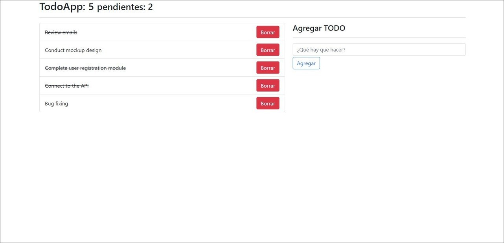

# Aplicación Todos con React
Esta aplicación web fue creada con las tecnologías React, Vite y TypeScript, con el objetivo de permitir registrar, eliminar y marcar tareas terminadas en una lista de Todos. Para los estilos se utilizó Bootstrap, y para las pruebas unitarias Jest. Además, se guarda la información en el LocalStorage.

## Tecnologías principales
-  React  
-  Vite  
-  TypeScript  
-  Jest  
-  Bootstrap  
-  LocalStorage  

## Capturas de pantalla
A continuación se muestran algunas capturas de pantalla de la aplicación en desktop:

## Créditos
Este proyecto fue creado a partir del curso "React: De cero a experto ( Hooks y MERN )" dictado por Fernando Herrera en Udemy. El link del curso es https://www.udemy.com/course/react-cero-experto/.

## Enlace
Puedes ver la aplicación en acción en el siguiente enlace: [Live site URL](https://todo-react-yha.netlify.app/).
